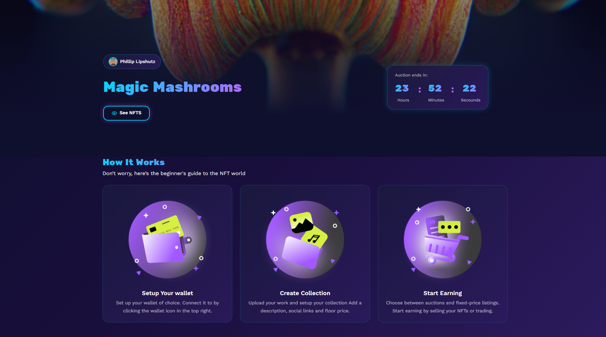

<h1 align="center">🌌 Galaxy – Web3 Decentralized Gaming & Betting Ecosytem</h1>
Galaxy is a  Web3 Decentralized Gaming & Betting Platform, designed to work seamlessly on all devices. Built with HTML, CSS, JavaScript, Bootstrap 5, and React + Vite, this template is optimized for performance, scalability, and a modern UI/UX.
 

## Demo

## programming language and tools

   

## Pages

* 🏠 Home
* 🏆 User Rankings
* 📞 Support
* 🖼 Product Page
* 👤 User Account
* 🏅 Member Account
* 🔑 Login
* 📝 Signup

## Features

✅ Fully Responsive – Adapts to all screen sizes

✅ React + Vite – Fast and efficient development setup

✅ Bootstrap 5 – Modern and flexible UI components

✅ Dark Mode Support – Trendy and easy on the eyes

✅ Optimized Performance – Lightweight and fast loading

## Prerequisites

Before you begin, ensure you have met the following requirements:

- [Git](https://git-scm.com/downloads "Download Git") must be installed on your operating system.

This program has been licensed under the MIT License. If you are a true FOSS (Free And Open Source Software) Lover, you wont customize this and redistribute this under your name
